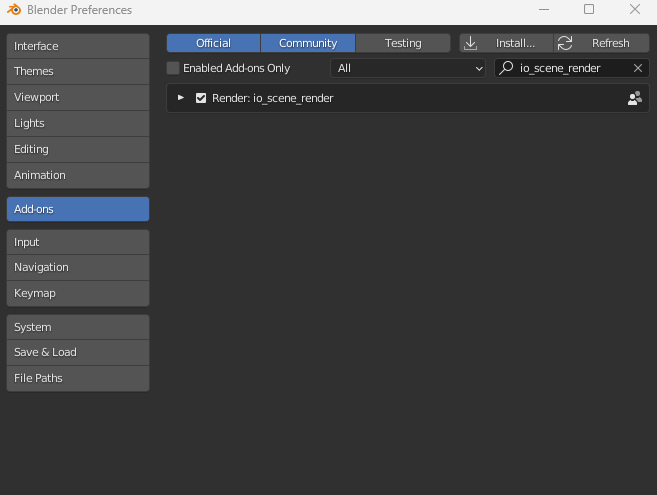
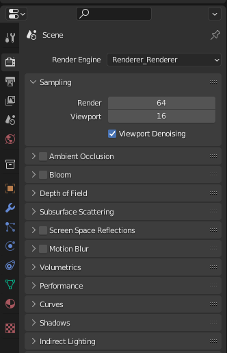
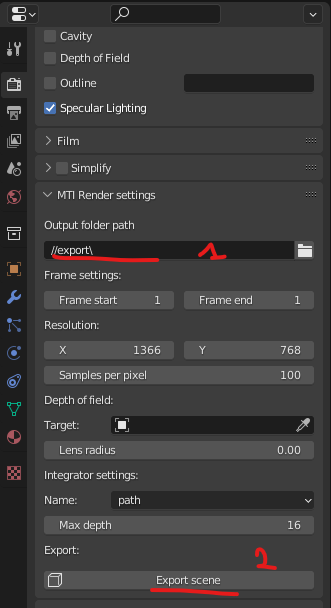

# MTI 882 - Blender exporter

This is the experimental blender exporter for MTI 882. 
This plugin have been only tested for Blender 3.2. 

## Installation

The main steps for installing this plugin:
1) Zip the directory `io_scene_render` inside this directory
2) Open Blender and go to: `Edit > Preferences > Add-ons` and click on the install button. 
3) Select the zip file created in the first step. 
4) Activate the plugin

5) Select `Renderer_Render` in the render engine

6) Go at the bottom of the panel (scrolling down). Specify inside `MTI Render settings` the output directory. Press export the scene.

## Issues
- If the output directory is not specify, the export button crash.

## TODOs
- Support more conversion from Cycles materials to renderer
- Add custom nodes for special BSDF
- Export envmap or background color
- Add more options to the exporter
- Export volume
